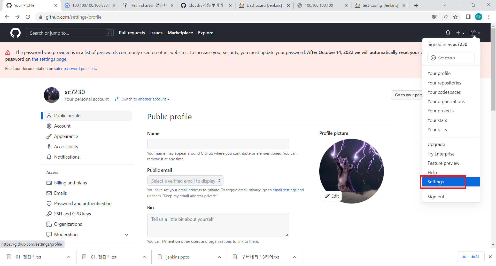
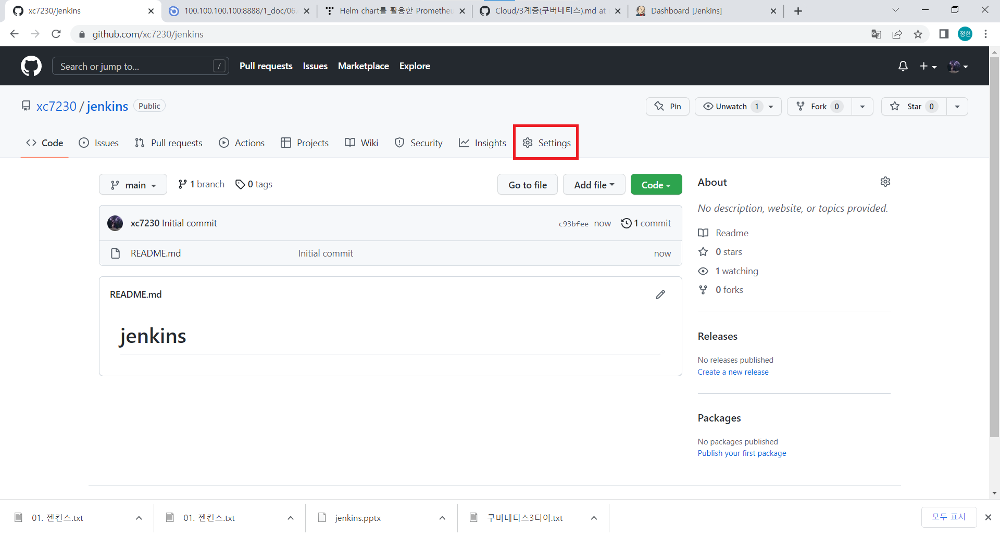

# jenkins

소프트웨어 개발 시 지속적으로 통합 서비스를 제공하는 툴<br/>

## 설치
- 자바 설치
```shell
dnf install -y java-11-openjdk-devel
```
- 레포지터리 추가
```shell
rpm --import https://pkg.jenkins.io/redhat-stable/jenkins.io.key
cd /etc/yum.repos.d/
curl -O https://pkg.jenkins.io/redhat-stable/jenkins.repo
dnf install -y jenkins
```

- 젠킨스 포트 변경
```shell
vi /usr/lib/systemd/system/jenkins.service
```
<br/>
8080포트를 9090으로 바꾼다.<br/>

- 젠킨스 실행
```shell
systemctl restart jenkins
```
내 아이피에 9090포트를 입력해 홈페이지에 접속<br/>
<br/>
표시된 부분을 복사해서 비밀번호를 확인한다.<br/>
```shell
cat /var/lib/jenkins/secrets/initialAdminPassword
```
<br/>

나타난 암호를 입력해서 접속해준다음 인스톨 해준다.<br/>
<br/>

설치가 끝나면 계정을 등록해주면 설정이 끝난다.<br/>
<br/>

## Jenkins와 Github 연동
젠킨스가 깔려있는 가상 os에 git을 설치한다.
```shell
yum install -y git
```
### github 접근 토큰 생성
내 깃허브 계정의 설정창에 들어간다.
<br/>
<br/>
<br/>
<br/>

깃허브에 들어가 젠킨스와 연동한 레포지터리를 하나 생성한 후 설정에 들어간다.<br/>
<br/>