# jenkins

소프트웨어 개발 시 지속적으로 통합 서비스를 제공하는 툴<br/>

## 설치
- 자바 설치
```shell
dnf install -y java-11-openjdk-devel
```
- 레포지터리 추가
```shell
rpm --import https://pkg.jenkins.io/redhat-stable/jenkins.io.key
cd /etc/yum.repos.d/
curl -O https://pkg.jenkins.io/redhat-stable/jenkins.repo
dnf install -y jenkins
```

- 젠킨스 포트 변경
```shell
vi /usr/lib/systemd/system/jenkins.service
```
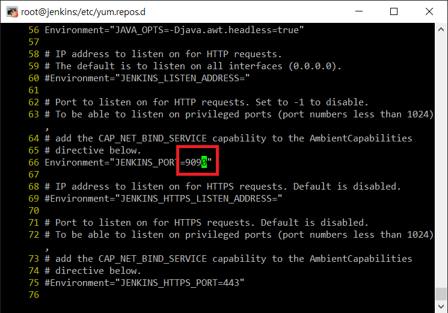<br/>
8080포트를 9090으로 바꾼다.<br/>

- 젠킨스 실행
```shell
systemctl restart jenkins
```
내 아이피에 9090포트를 입력해 홈페이지에 접속<br/>
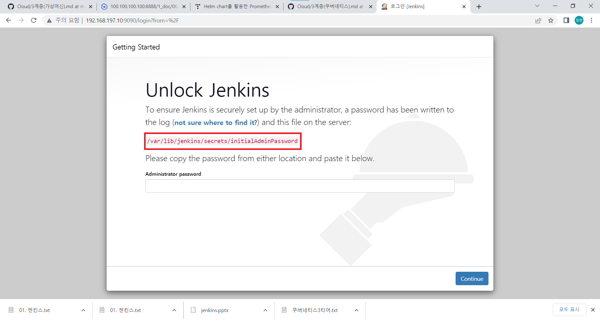<br/>
표시된 부분을 복사해서 비밀번호를 확인한다.<br/>
```shell
cat /var/lib/jenkins/secrets/initialAdminPassword
```
<br/>

나타난 암호를 입력해서 접속해준다음 인스톨 해준다.<br/>
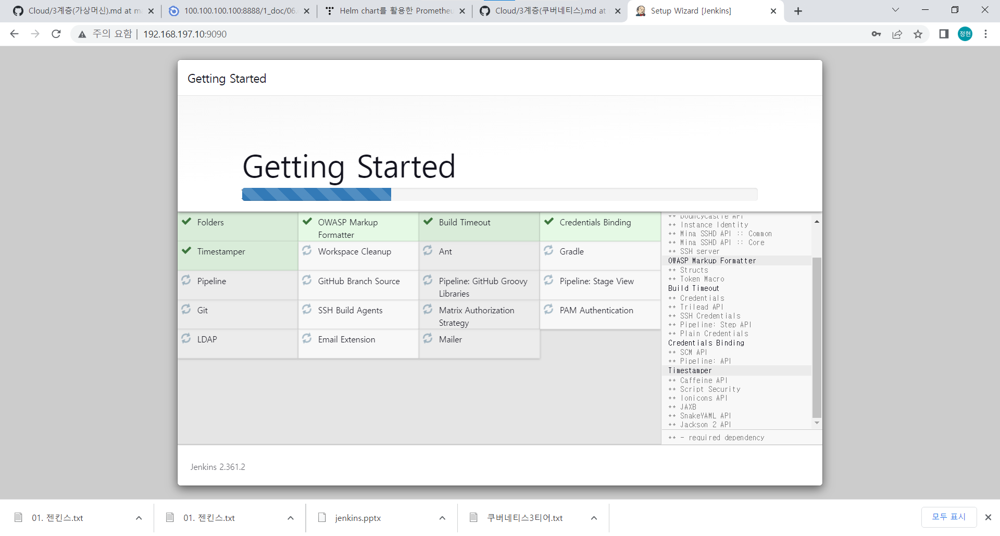<br/>

설치가 끝나면 계정을 등록해주면 설정이 끝난다.<br/>
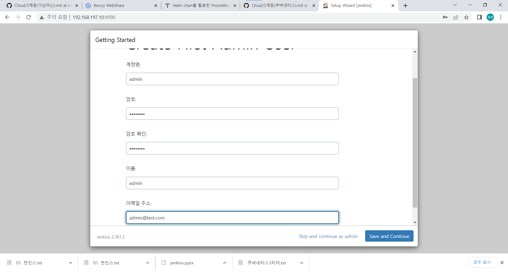<br/>

## Jenkins와 Github 연동
젠킨스가 깔려있는 가상 os에 git을 설치한다.
```shell
yum install -y git
```

1. github 토큰 생성<br/>
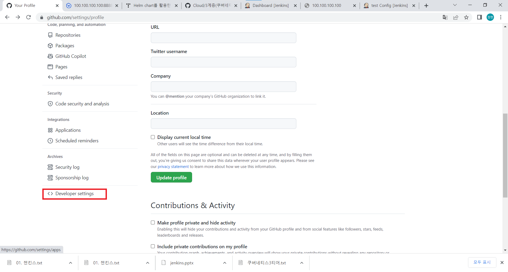<br/>
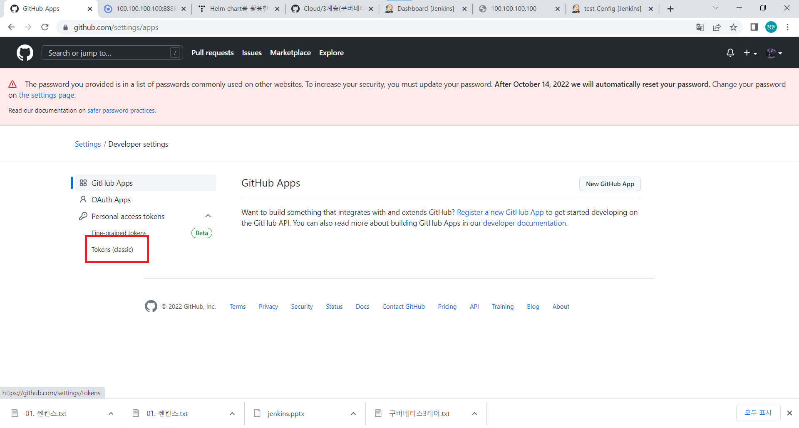<br/>
토큰 이름을 입력하고 다음 설정들을 해주고 저장해준다.<br/>
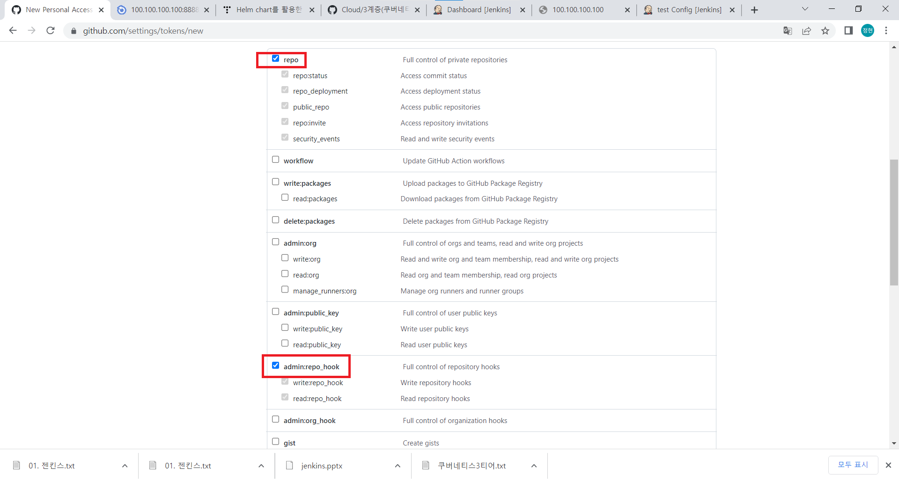<br/>
나온 토큰 번호는 따로 저장해서 보관해둔다.<br/>

2. 젠킨스에서 api key 생성<br/>
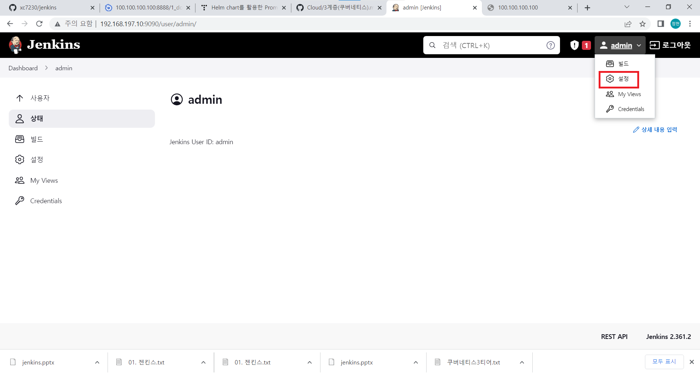<br/>
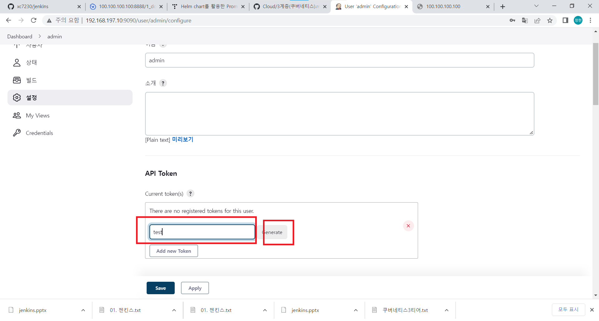<br/>
나온 api key도 따로 저장해둔다.<br/>

3. github 웹훅 설정<br/>
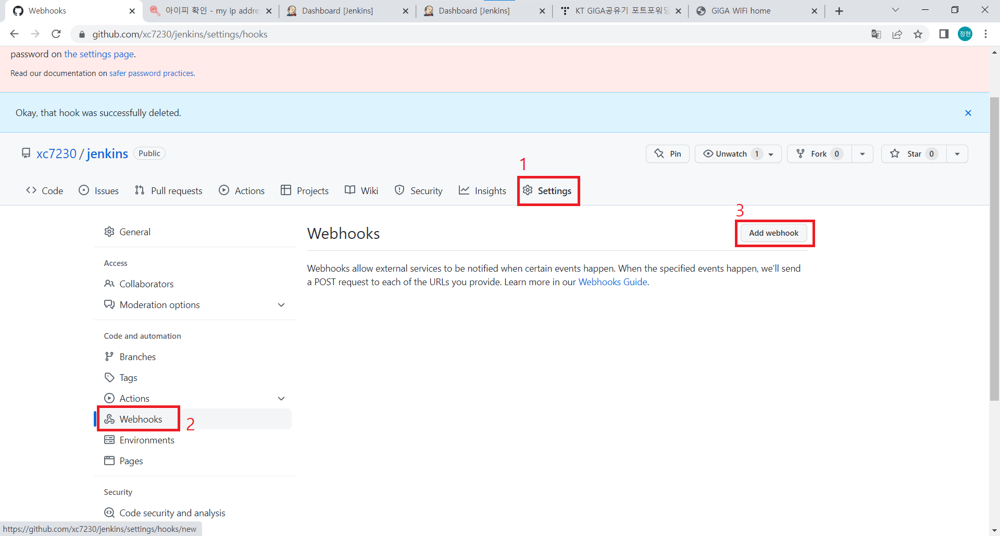<br/>
깃허브에 젠킨스에 연결할 레포지터리 setting에 Webhook에 들어간다.<br/>
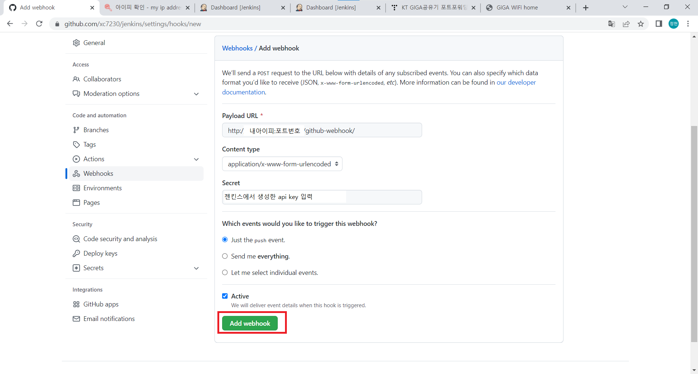<br/>
내 젠킨스 아이피와 포드번호를 입력해주고 2번에서 생성한 api key를 입력하고 웹훅을 생성해준다.<br/>

4. 파이프라인 생성<br/>
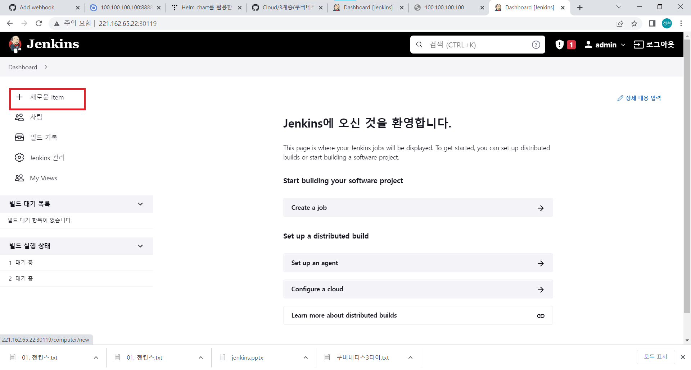<br/>
이름을 입력하고 `FreeFreestyle`선택 후 `OK`를 누른다.
<br/>
`GitHub project` 체크<br/>
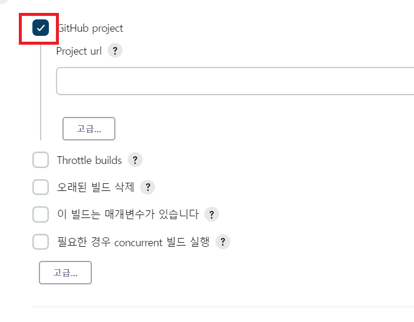<br/>
소스 코드 관리에서 `Git` 체크 후 연결할 github 레포지터리 주소 입력 후 credential을 등록한다.<br/>
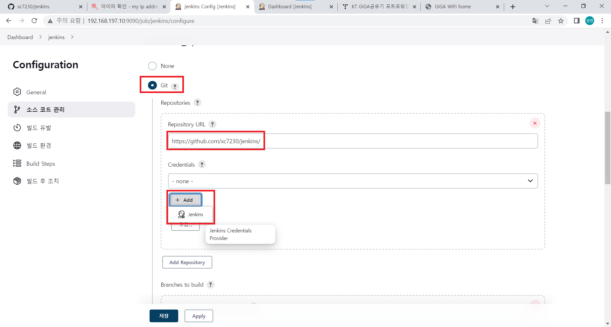<br/>
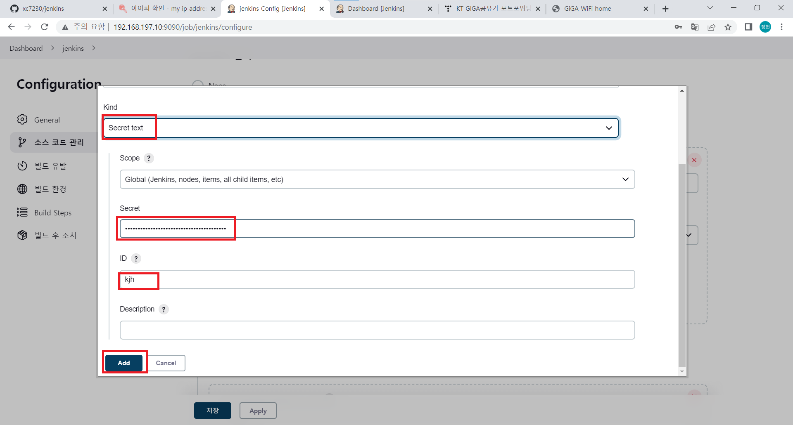<br/>
빌드 유발에서 `GitHub hook trigger for GITScm polling` 체크
<br/>
`Build Step`s에서 `Add build step` 클릭 후 `Execute shel`l클릭 후 `echo test` 입력한 다음 `저장`을 누른다.
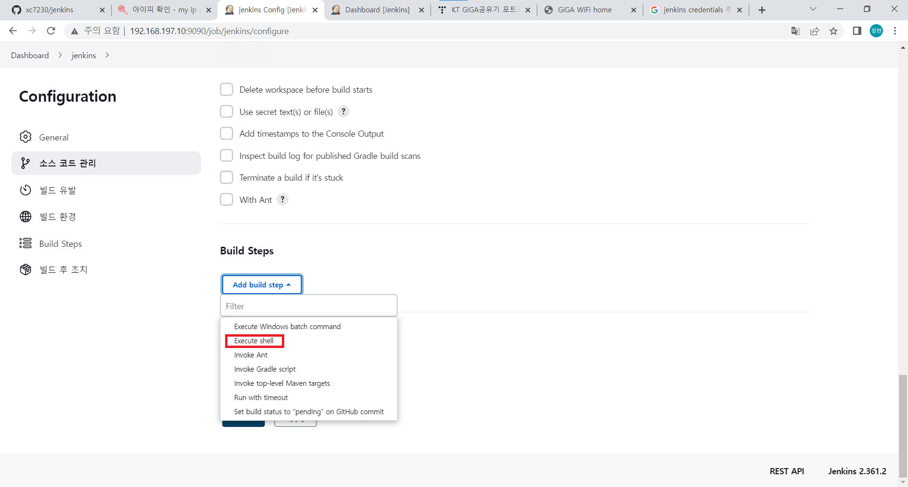<br/>
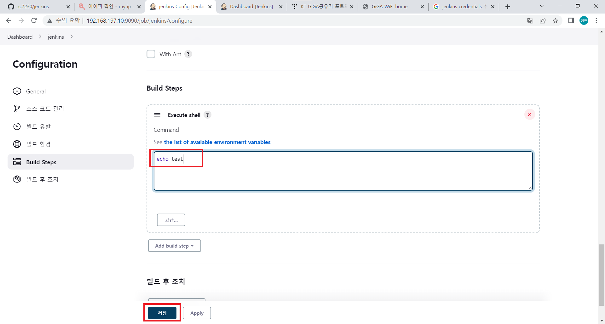<br/>

5. 확인<br/>
대시보드를 나가 다음과 같이 체크가 됐으면 성공이다.<br/>
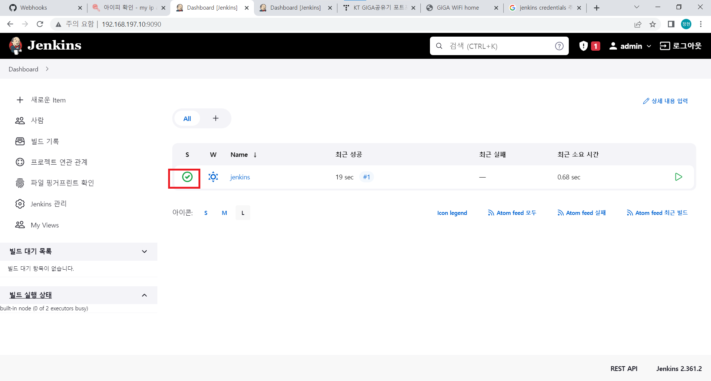<br/>


