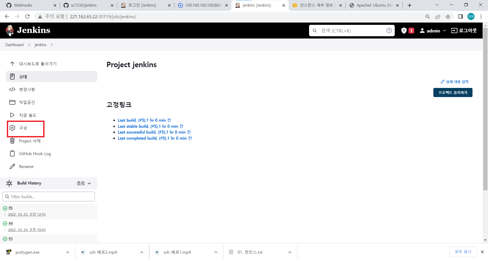

# jenkins

소프트웨어 개발 시 지속적으로 통합 서비스를 제공하는 툴<br/>

## 설치
- 자바 설치
```shell
dnf install -y java-11-openjdk-devel
```
- 레포지터리 추가
```shell
rpm --import https://pkg.jenkins.io/redhat-stable/jenkins.io.key
cd /etc/yum.repos.d/
curl -O https://pkg.jenkins.io/redhat-stable/jenkins.repo
dnf install -y jenkins
```

- 젠킨스 포트 변경
```shell
vi /usr/lib/systemd/system/jenkins.service
```
<br/>
8080포트를 9090으로 바꾼다.<br/>

- 젠킨스 실행
```shell
systemctl daemon-reload
systemctl restart jenkins
```
내 아이피에 9090포트를 입력해 홈페이지에 접속<br/>
<br/>
표시된 부분을 복사해서 비밀번호를 확인한다.<br/>
```shell
cat /var/lib/jenkins/secrets/initialAdminPassword
```
<br/>

나타난 암호를 입력해서 접속해준다음 인스톨 해준다.<br/>
<br/>

설치가 끝나면 계정을 등록해주면 설정이 끝난다.<br/>
<br/>

## Jenkins와 Github 연동
젠킨스가 깔려있는 가상 os에 git을 설치한다.
```shell
yum install -y git
```

1. github 토큰 생성<br/>
<br/>
<br/>
토큰 이름을 입력하고 다음 설정들을 해주고 저장해준다.<br/>
<br/>
나온 토큰 번호는 따로 저장해서 보관해둔다.<br/>

2. 젠킨스에서 api key 생성<br/>
<br/>
<br/>
나온 api key도 따로 저장해둔다.<br/>

3. github 웹훅 설정<br/>
<br/>
깃허브에 젠킨스에 연결할 레포지터리 setting에 Webhook에 들어간다.<br/>
<br/>
내 젠킨스 아이피와 포드번호를 입력해주고 2번에서 생성한 api key를 입력하고 웹훅을 생성해준다.<br/>

4. 파이프라인 생성<br/>
<br/>
이름을 입력하고 `FreeFreestyle`선택 후 `OK`를 누른다.
<br/>
`GitHub project` 체크<br/>
<br/>
소스 코드 관리에서 `Git` 체크 후 연결할 github 레포지터리 주소 입력 후 credential을 등록한다.<br/>
<br/>
<br/>
빌드 유발에서 `GitHub hook trigger for GITScm polling` 체크
<br/>
`Build Step`s에서 `Add build step` 클릭 후 `Execute shel`l클릭 후 `echo test` 입력한 다음 `저장`을 누른다.
<br/>
<br/>

5. 확인<br/>
대시보드를 나가 다음과 같이 체크가 됐으면 성공이다.<br/>
<br/>
연결된 레포지터리에 있는 여러 코드들을 `git`에 `commit`하고 `push`해본다.
<br/>
내 github에 push가 된게 jenkins에 전달이 된다.<br/>
<br/>

## 파이참에 git 연동
1. 파이참에 git 계정 설정<br/>
<br/>
<br/>
<br/>
연동할 깃허브 계정 입력<br/>

2. 원격 저장소에 파일 받아오기<br/>
<br/>
<br/>

3. 개발 도구에서 push하기<br/>
받아온 원격 저장소 파일에서 html 파일 생성 후 내용 입력<br/>
<br/>
<br/>
<br/>
<br/>

## SSH를 이용해서 배포
1. 젠킨스에 플러그인 설치<br/>
<br/>
`Publish Over SSH` 체크하고 `Download now and install after restart` 하고 젠킨스 재시작<br/>
<br/>

2. 젠킨스 서버에서 SSH Key 설정<br/>
- EC2를 생성할 때 사용한 키 파일을 pem 형식으로 변환
    - puttygen 다운
    <br/>

    - AWS에서 쓰던 `.ppk`파일 불러오기<br/>
    <br/>
    - Export OpenSSH Key로 `.pem` 형식으로 저장<br/>
    <br/>
    - 저장한 파일 Jenkins 서버로 옮기기<br/>
        ```shell
        vi cloudcamp.pem    # pem 파일 안에 있는 key 복사 붙여넣기
        chmod 400 cloudcamp.pem # 권한 부여
        ssh ubuntu@43.201.116.74 -i cloudcamp.pem # ssh ubuntu@ec2의ip주소 -i 키파일
        ```
        <br/>

3. 젠킨스 설정 수정<br/>
<br/>
`cloudcamp.pem` 내용 입력<br/>
<br/>
success가 뜨면 저장을 누른다.<br/>
<br/>
내가 만든 jenkins에 들어간다.<br/>
<br/>
<br/>
<br/>
`sudo bash -c "cp -f /home/ubuntu/* /var/www/html/"` 삽입 후 저장<br/>
<br/>
- 파이참에서 다시 내용을 입력해서 commit push를 해본다.<br/>
<br/>
<br/>

## 젠킨스로 컨테이너 이미지 만들기<br/>
1. 젠킨스 서버에 도커 설치<br/>
    ```shell
    yum install -y yum-utils 
    yum-config-manager --add-repo https://download.docker.com/linux/centos/docker-ce.repo
    yum-config-manager --enable docker-ce-nightly
    yum-config-manager --enable docker-ce-test
    yum install -y docker-ce docker-ce-cli containerd.io --allowerasing

    systemctl enable docker
    systemctl restart docker
    ```
2. 젠킨스로 도커 이미지 생성<br/>
- 파이참 프로젝트에서 `Dockerfile` 작성<br/>
    <br/>
    ```shell
    FROM httpd:2.4
    EXPOSE 80
    ADD ./* /usr/local/apache2/htdocs/
    CMD httpd-foreground
    ```
- commit, push로 github에 업로드 하기<br/>
```shell
docker login -u 도커아이디 -p 비밀번호
docker build --tag xc7230/hello:$BUILD_ID .
docker push xc7230/hello:$BUILD_ID
```
<br/>
빌드가 성공이 되면 도커 허브에 들어가 재대로 push가 됐는지 확인한다.<br/>
<br/>

## 쿠버네티스 환경에 배포
1. k8s master 노드에서 ssh 키 설정<br/>
```shell
cd ~/.ssh
ssh-keygen -t rsa -b 4096 -m PEM  #엔터 3번
ssh-copy-id root@마스터노드IP   # 비밀번호 설정
cat id_rsa # 내용 복사
chmod 400 id_rsa
ssh root@마스터노드IP -i id_rsa
```