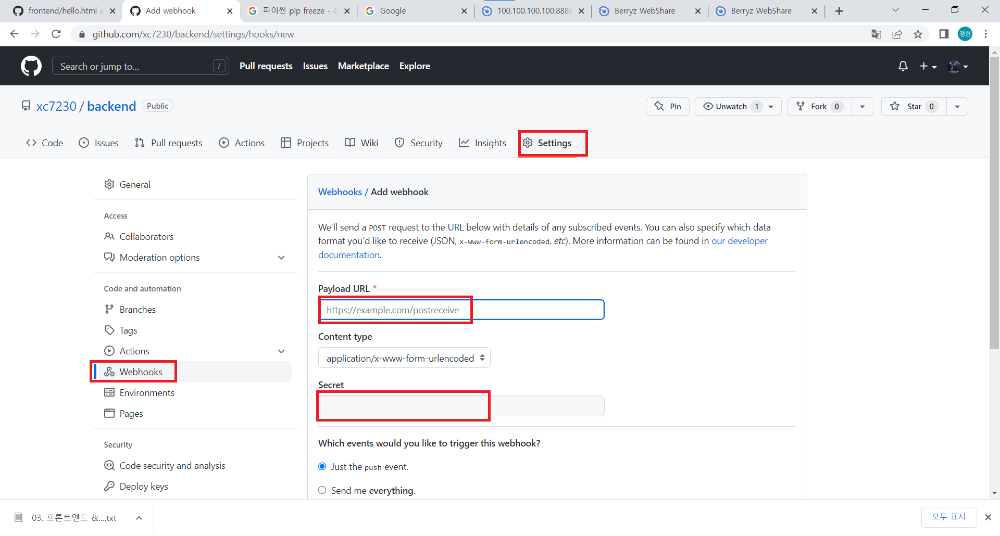
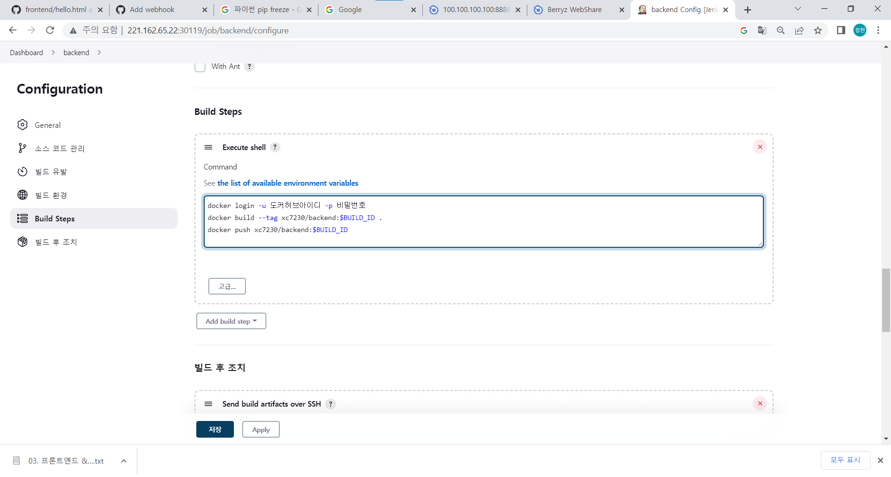
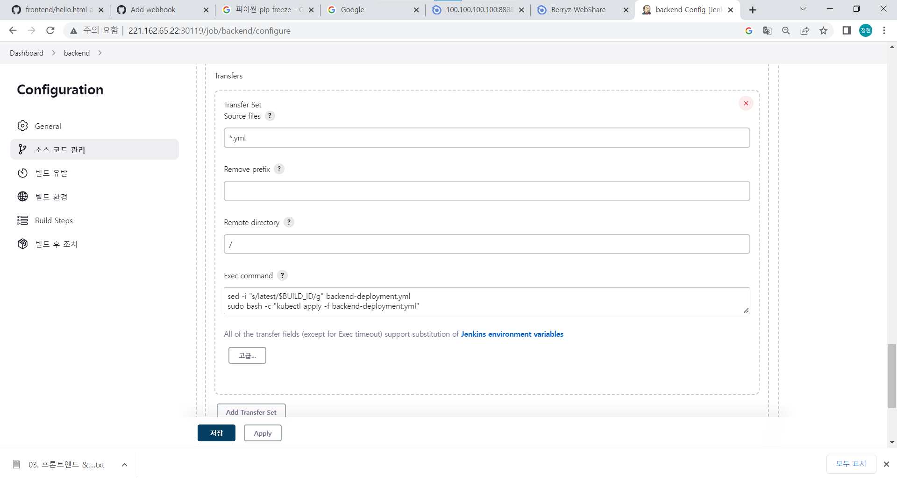
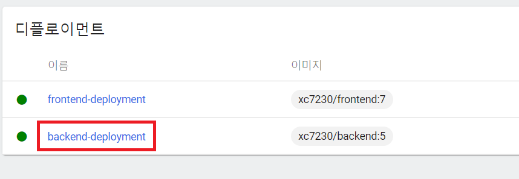
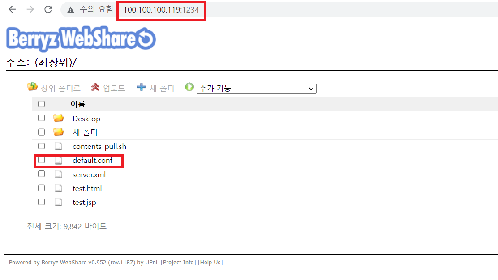
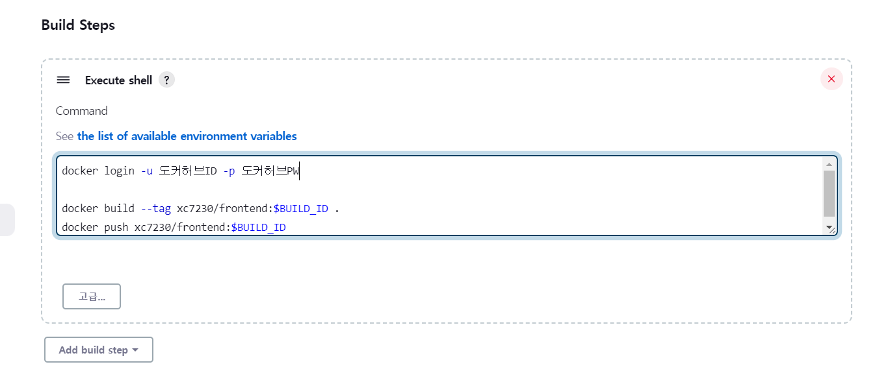
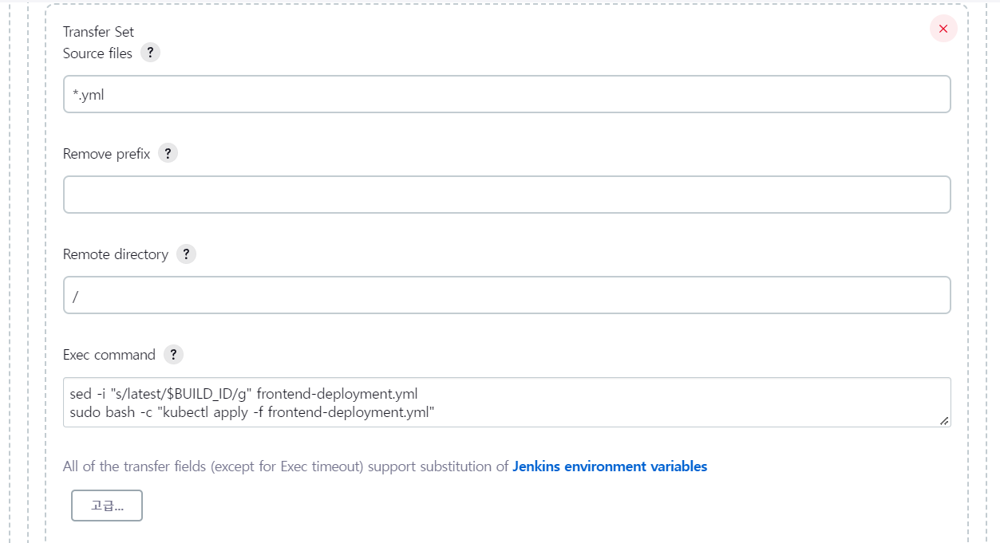
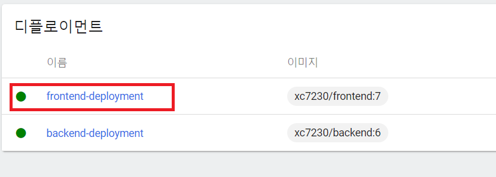
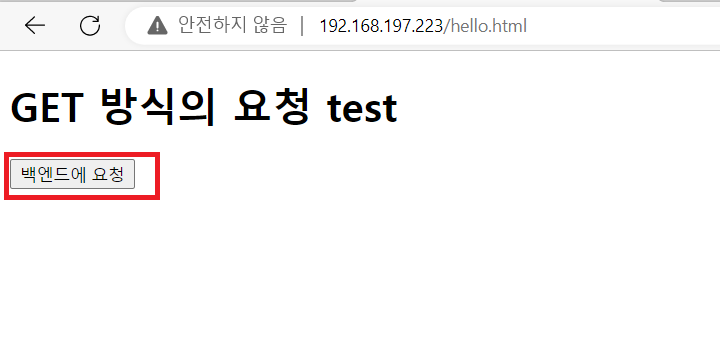
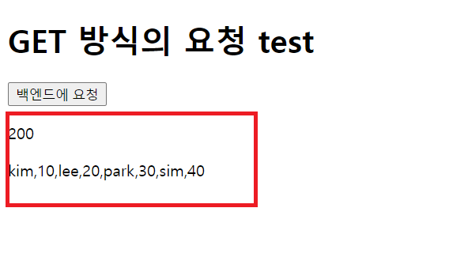

# Nginx를 ci/cd 환경으로 구축
## Backend 환경 설정
1. backend디렉토리를 만들고 파이참을 이용해 프로젝트 하나를 생성한다.
2. 파이참에서 VCS -> Share Project on GitHub -> Share -> .idea 폴더 체크 해제 -> Add로 내 github와 연동해 Jenkins와 연동할 레포지터리를 생성한다.
3. 만들어진 레포지터리 setting에 들어가 webhook을 설정, 생성해준다.
<br/>
- Payload URL: http://내젠킨스ip/github-webhook/
- Secret : 젠킨스에서 발급한 시크릿 키
4. backend 배포 설정<br/>
- flask연습했던 프로젝트에서 라이브러리 목록을 가져온다.
```python
pip freeze > requirements.txt   #생성된 목록 파일을 깃허브 디렉토리에 옮겨 놓는다.
```

- 도커파일 생성(깃허브와 연동된 디렉토리에 생성한다.)<br/>
`Dockerfile`
```shell
FROM python:3.9

WORKDIR /apps
ADD requirements.txt /apps/
RUN pip install -r /apps/requirements.txt
ADD *.py /apps/
EXPOSE 8000
CMD /usr/local/bin/gunicorn --bind 0.0.0.0:8000 wsgi:app
```

- backend-deployment.yml<br/>
```yaml
apiVersion: apps/v1
kind: Deployment
metadata:
 name: backend-deployment
spec:
 selector:
   matchLabels:
    type: backend
 replicas: 2
 template:
   metadata:
     labels:
       type: backend
   spec:
    containers:
    - name: backend
      image: xc7230/backend:latest  # 도커허브에 backend 레포지터리를 생성한다.
      envFrom:
      ports:
      - containerPort: 8000
      resources:
        requests:
          cpu: 100m
        limits:
          cpu: 200m

```

5. 젠킨스에 backend 연동<br/>
- 파이프 라인 생성
    - 기존에 생성했던 것과 같은 설정에서 `Execute shell` 을 바꿔준다.<br/>
        <br/>
        ```shell
        docker login -u 도커허브ID -p 도커허브PW

        docker build --tag 이미지이름:$BUILD_ID .
        docker push 이미지 이름:$BUILD_ID
        ```
    - `Send build artifacts over SSH` 입력 후 저장
        <br/>
        ```shell
        sed -i "s/latest/$BUILD_ID/g" backend-deployment.yml
        sudo bash -c "kubectl apply -f backend-deployment.yml"
        ```

6. 확인<br/>
- Githubd에 `commit`, `push`를 해서 쿠버네티스에 자동으로 디플로이먼트가 생성되는지 확인한다.<br/>
<br/>

7. 서비스 생성<br/>
```yaml
apiVersion: v1
kind: Service
metadata:
  name: backend-svc
spec:
  selector:
    type: backend
  ports:
  - port: 8000
    targetPort: 8000
```


## frontend 환경 설정
1. backend디렉토리를 만들고 파이참을 이용해 프로젝트 하나를 생성한다.<br/>
2. 위를 참조하여 frontend 파이참 프로젝트에서 github를 연동해준다.
3. 위를 참조하여 만들어진 레포지터리 setting에 들어가 webhook을 설정, 생성해준다.
4. frontend 배포 설정<br/>
- `Dockerfile`생성
    ```shell
    FROM nginx:latest
    EXPOSE 80
    RUN rm -rf /etc/nginx/conf.d/default.conf
    RUN apt update && apt install wget
    ADD *.html /usr/share/nginx/html/
    CMD wget http://100.100.100.119:1234/default.conf -O /etc/nginx/conf.d/default.conf && nginx -g 'daemon off;'
    ```
   -  http://100.100.100.119:1234/default.conf 같은 경우 직접 공유 웹(berryz web을 이용해 파일을 업로드 했다.)<br/>
   <br/>

- `frontend-deployment.yml` 생성
```yaml
apiVersion: apps/v1
kind: Deployment
metadata:
 name: frontend-deployment
spec:
 selector:
   matchLabels:
    type: frontend
 replicas: 2
 template:
   metadata:
     labels:
       type: frontend
   spec:
    containers:
    - name: frontend
      image: cloudcamp2022/frontend:latest
      envFrom:
      ports:
      - containerPort: 80
      resources:
        requests:
          cpu: 100m
        limits:
          cpu: 200m
```

5. 젠킨스에 frontend 연동<br/>
- 파이프라인 생성<br/>
    - 기존에 생성했던 것과 같은 설정에서 `Execute shell` 을 바꿔준다.<br/>
        <br/>
        ```shell
        docker login -u 도커허브ID -p 도커허브PW

        docker build --tag 이미지이름:$BUILD_ID .
        docker push 이미지 이름:$BUILD_ID
        ```

    - `Send build artifacts over SSH` 입력 후 저장
        <br/>
        ```shell
        sed -i "s/latest/$BUILD_ID/g" frontend-deployment.yml
        sudo bash -c "kubectl apply -f frontend-deployment.yml"
        ```
6. 확인<br/>
<br/>

7. 서비스 생성<br/>
```yaml
apiVersion: v1
kind: Service
metadata:
  name: frontend-svc
spec:
  selector:
    type: frontend
  ports:
  - port: 80
    targetPort: 80
  type: LoadBalancer

---
apiVersion: v1
kind: Service
metadata:
  name: frontend-svc2
spec:
  selector:
    type: frontend
  ports:
  - port: 8080
    targetPort: 8080
  type: LoadBalancer
```
## DB 환경설정
1. 시크릿키 생성<br/>
```yaml
apiVersion: v1
kind: Secret
metadata:
  name: mysql-sec
data:
  MYSQL_ROOT_PASSWORD: cXdlcjEyMzQ=
```

2. 볼륨설정<br/>
```yaml
apiVersion: v1
kind: PersistentVolume
metadata:
  name: mysql-pv
spec:
  capacity:
    storage: 10G
  accessModes:
  - ReadWriteOnce
  local:
    path: /mysql-volume
  nodeAffinity:
    required:
      nodeSelectorTerms:
      - matchExpressions:
        - {key: kubernetes.io/hostname, operator: In, values: [node1]}

---

apiVersion: v1
kind: PersistentVolumeClaim
metadata:
  name: mysql-pvc
spec:
  accessModes:
  - ReadWriteOnce
  resources:
    requests:
      storage: 10G
  storageClassName: ""
```

3. 파드생성<br/>
```yaml
apiVersion: v1
kind: Pod
metadata:
  name: mysql-pod
  labels:
    type: db
spec:
  nodeSelector:
    kubernetes.io/hostname: node1
  containers:
  - name: container
    image: mysql:latest
    ports:
    - containerPort: 3306
    envFrom:
    - secretRef:
        name: mysql-sec
    volumeMounts:
    - name: mysql-pvc-pv
      mountPath: /var/lib/mysql
  volumes:
  - name : mysql-pvc-pv
    persistentVolumeClaim:
      claimName: mysql-pvc
```

4. 서비스 생성<br/>
```yaml
apiVersion: v1
kind: Service
metadata:
  name: mysql-svc
  labels:
    app: mysql-svc
spec:
  selector:
    type: db
  ports:
  - port: 3306
    targetPort: 3306
```

5. DB 생성
- DB 접속 후 
```sql
CREATE DATABASE [DB 이름];
use [DB 이름];
-- 테이블 생성
CREATE TABLE student (sname VARCHAR(10), sage INT);

-- 데이터 생성
INSERT INTO student VALUES('kim',10);
INSERT INTO student VALUES('lee',20);
INSERT INTO student VALUES('park',30);
INSERT INTO student VALUES('sim',40);
```

6. 컨피그맵 생성<br/>
```yaml
apiVersion: v1
kind: ConfigMap
metadata:
  name: mysql-cm
data:
  DB_HOST: 'mysql-svc'
  DB_USER: 'root'
  DB_NAME: 'kjh_db'
```
7. backend에 있는 설정 변경<br/>
`main.py`<br/>
[참조](https://github.com/xc7230/backend/blob/master/main.py)

8. backend의 yaml파일이 컨피그 맵을 받을 수 있게 설정<br/>
```yaml
apiVersion: apps/v1
kind: Deployment
metadata:
 name: backend-deployment
spec:
 selector:
   matchLabels:
    type: backend
 replicas: 2
 template:
   metadata:
     labels:
       type: backend
   spec:
    containers:
    - name: backend
      image: xc7230/backend:latest
      envFrom:
        - configMapRef:
            name: mysql-cm
        - secretRef:
            name: mysql-sec
      ports:
      - containerPort: 8000
      resources:
        requests:
          cpu: 100m
        limits:
          cpu: 200m
```

9. 연동 확인<br/>
frontend의 로드벨런스 아이피로 접속을 해서 `백엔드에 요청`버튼을 눌러 DB의 내용이 출력되면 성공이다.<br/>
<br/>
<br/>
